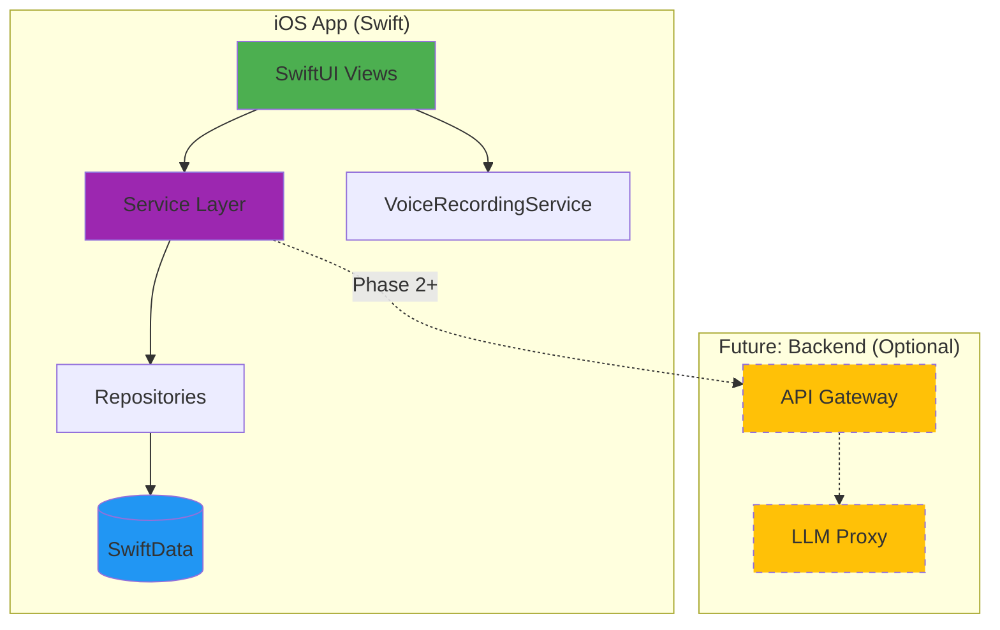
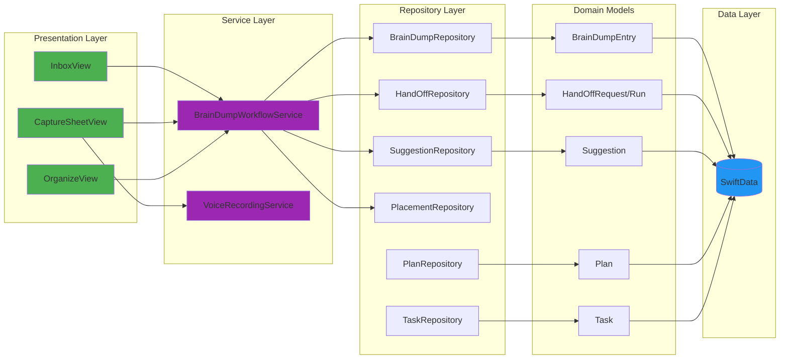
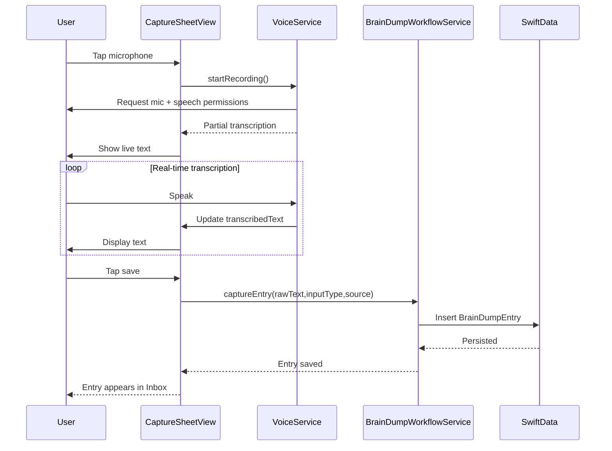

# Offload

An iOS app to quickly capture thoughts and organize them later, optionally with AI assistance.

[](https://www.apple.com/ios/)
[](https://swift.org)
[](https://developer.apple.com/xcode/swiftui/)
[](LICENSE)

## Table of Contents

- [About](#about)
- [Current Status](#current-status)
- [Architecture](#architecture)
- [Data Model](#data-model)
- [Project Structure](#project-structure)
- [Getting Started](#getting-started)
- [Features](#features)
- [Documentation](#documentation)
- [Tech Stack](#tech-stack)
- [Contributing](#contributing)
- [License](#license)

## About

Offload is an iOS-first app that turns quick thought captures (text or voice) into simple, organized **plans** and lists—tasks, shopping, and follow-ups—so you can get mental space back.

Most productivity tools assume you'll calmly plan everything up front. Offload starts where real life starts: random thoughts, urgency spikes, and "I'll remember" moments. Capture in seconds, then let the app help you sort and clarify what's next—without making everything feel time-sensitive or turning your life into a project management system.

The app follows a simple principle:

**Capture First, Organize Later (Optionally with AI)**

### Core Philosophy

- **Psychological Safety**: No guilt, no shame, no forced structure
- **Offline-First**: Works completely offline, on-device processing
- **User Control**: AI suggests, never auto-modifies
- **Privacy**: All data stays on device, no cloud required

## Current Status

🚧 **Active Development** - Pre-release prototype

### ✅ Implemented

- Thought capture data model (CaptureEntry, HandOff*, Suggestion, Placement) stored with SwiftData
- Destination models for plans, tasks, tags, categories, lists, and communication items
- Repository layer for all models plus a CaptureWorkflowService for capture and inbox operations
- SwiftUI inbox and capture sheet with voice recording and transcription via `VoiceRecordingService`

### 🔄 In Progress

- Organization surfaces for plans, tags, and categories (Organize tab scaffolded)
- AI hand-off orchestration, suggestion processing, and placement (stubbed in workflow service)
- Settings and deeper navigation

### 📋 Upcoming

- AI-assisted organization with user approval
- Expanded placement targets and manual organization flows
- Optional backend sync, widgets, and sharing after validation

## Architecture

### System Overview



### iOS App Architecture

Feature-based modular architecture with clear separation of concerns:



## Data Model

### Capture & Destination Models

- **Capture + Workflow**: BrainDumpEntry → HandOffRequest → HandOffRun → Suggestion → SuggestionDecision → Placement
- **Destinations**: Plan/Task, Tag, Category, ListEntity/ListItem, CommunicationItem
- **Lifecycle States**: raw → handedOff → ready → placed → archived

```mermaid
flowchart LR
    Entry[BrainDumpEntry\n(raw capture)]
    Request[HandOffRequest]
    Run[HandOffRun]
    Suggestion[Suggestion]
    Decision[SuggestionDecision]
    Placement[Placement\n(targetType,targetId)]
    Destination[Plans / Tasks / Lists / Communication]

    Entry --> Request --> Run --> Suggestion --> Decision --> Placement --> Destination
```

### Data Flow: Capture to Inbox



## Project Structure

This is a monorepo containing:

```text
offload/
├── ios/                          # iOS application
│   ├── Offload/
│   │   ├── App/                  # Application entry point
│   │   ├── Features/             # Feature modules
│   │   │   ├── Capture/          # Voice & text capture
│   │   │   ├── Inbox/            # Thought inbox
│   │   │   └── Organize/         # Task organization
│   │   ├── Domain/               # Business logic
│   │   │   └── Models/           # SwiftData models
│   │   ├── Data/                 # Data layer
│   │   │   ├── Repositories/     # Data access
│   │   │   ├── Persistence/      # SwiftData setup
│   │   │   └── Services/         # Voice, AI services
│   │   ├── DesignSystem/         # UI components, theme
│   │   └── Resources/            # Assets
│   └── OffloadTests/             # Unit tests
├── backend/                      # Backend services (Phase 3+)
├── docs/                         # Documentation
│   ├── prd/                      # Product requirements
│   ├── decisions/                # Architecture Decision Records
│   ├── plans/                    # Implementation plans
│   └── testing/                  # Test guides and results
└── scripts/                      # Build scripts
```

## Getting Started

### Prerequisites

- **Xcode 15.0+** (for iOS 17 support)
- **iOS 17.0+** target device or simulator
- **macOS 14.0+** for development

### Building & Running

1. **Clone the repository**

   ```bash
   git clone https://github.com/Will-Conklin/offload.git
   cd offload
   ```

2. **Open the Xcode project**

   ```bash
   open ios/Offload.xcodeproj
   ```

3. **Select a target**
   - For simulator: Choose any iOS 17+ simulator
   - For device: Connect iPhone and select it

4. **Build and run** (⌘R)

### Running Tests

Run tests with ⌘U in Xcode. Unit tests use in-memory SwiftData containers so they are isolated and fast; ensure test files are included in the `OffloadTests` target after adding new ones.

## Features

### ✅ Implemented

- **Capture**: Text and voice capture with live transcription using the Speech framework (offline-first)
- **Inbox**: Thought inbox with lifecycle tracking (raw → archived)
- **Data Layer**: SwiftData models for capture workflow plus destinations (plans, tasks, tags, categories, lists, communication)
- **Repositories**: CRUD + lifecycle helpers for every model
- **Workflow Service**: `BrainDumpWorkflowService` for capture, inbox queries, and lifecycle actions

### 🚧 In Development

- Manual organization surfaces for plans, tags, and categories
- AI hand-off orchestration and suggestion processing
- Settings, deeper navigation, and placement flows

### 📅 Planned

- AI-assisted organization with explicit user approval
- Optional backend sync and collaboration features
- Widgets, share extension, and recurrence (based on validation)

## Documentation

### Core Documentation

- 📱 [iOS Development Guide](ios/README.md)
- 📋 [Product Requirements Document](docs/prd/v1.md)
- 🏗️ [Architecture Decision Records](docs/decisions/)
- 🧠 [Thought Capture Model Plan](docs/plans/brain-dump-model.md)
- 📦 [Project Scaffolding Details](ios/SCAFFOLDING.md)

### Testing & Development

- 🎤 [Voice Capture Testing Guide](docs/testing/voice-capture.md)
- 📊 [Voice Capture Test Results](docs/testing/voice-capture-results.md)
- 🧪 SwiftData repositories and workflow tests in `ios/OffloadTests`

### Implementation

- ✅ Thought capture data layer and repositories
- 🔄 Inbox and capture experience
- 🔄 Organization UI and AI hand-off workflows

## Tech Stack

### iOS Application

- **UI Framework**: SwiftUI 5.0
- **Persistence**: SwiftData (iOS 17+)
- **Speech**: iOS Speech Framework (offline)
- **Audio**: AVFoundation (AVAudioEngine)
- **Architecture**: Feature-based modules, Repository pattern

### Backend (Phase 3+)

- **Language**: Python (FastAPI)
- **AI**: OpenAI/Anthropic API proxy
- **Infrastructure**: TBD

### Development

- **Language**: Swift 5.9
- **Min iOS**: 17.0
- **Testing**: XCTest + SwiftData in-memory containers
- **CI/CD**: GitHub Actions (planned)

See [ADR-0001](docs/decisions/ADR-0001-stack.md) for detailed technical decisions.

## Development Principles

### Friction-Free Design

- **No Forced Structure**: Capture without categorization
- **No Guilt**: No red warnings, no streaks, no shame
- **No Auto-Modification**: AI suggests, user decides
- **Offline-First**: Works without internet

### Privacy & Safety

- **On-Device Processing**: Speech recognition runs locally
- **No Cloud Dependency**: All data stays on device (Phase 1-2)
- **Optional Backend**: Cloud features are opt-in (Phase 3+)
- **No Tracking**: No analytics, no telemetry

### Code Quality

- **Test Coverage**: Comprehensive unit tests (45+ tests)
- **Type Safety**: SwiftData relationships with proper typing
- **Documentation**: Inline docs, ADRs, detailed commit messages
- **Conventional Commits**: Semantic versioning ready

## Contributing

This is currently a personal project. Contributions guidelines to be added.

## License

See [LICENSE](LICENSE) for details.
