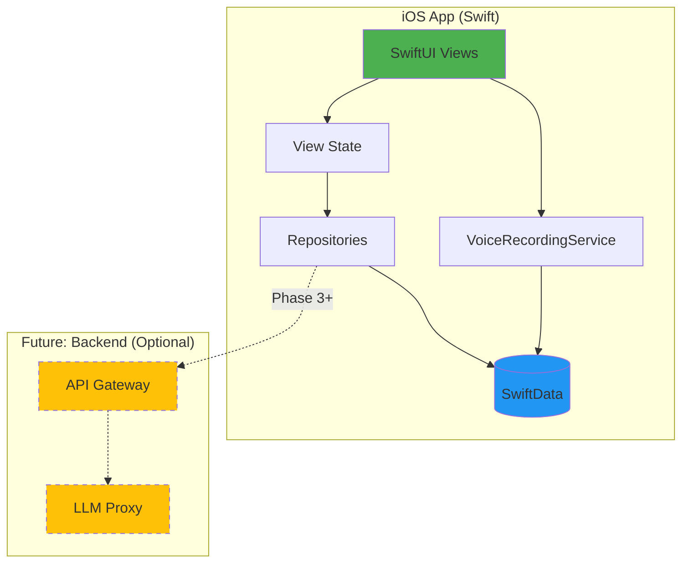
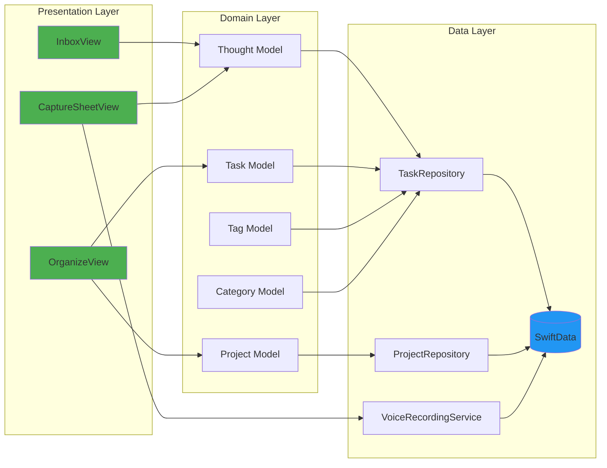
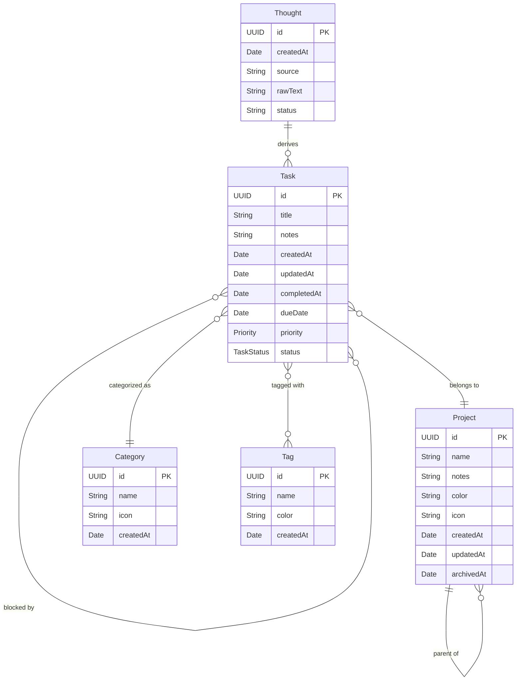
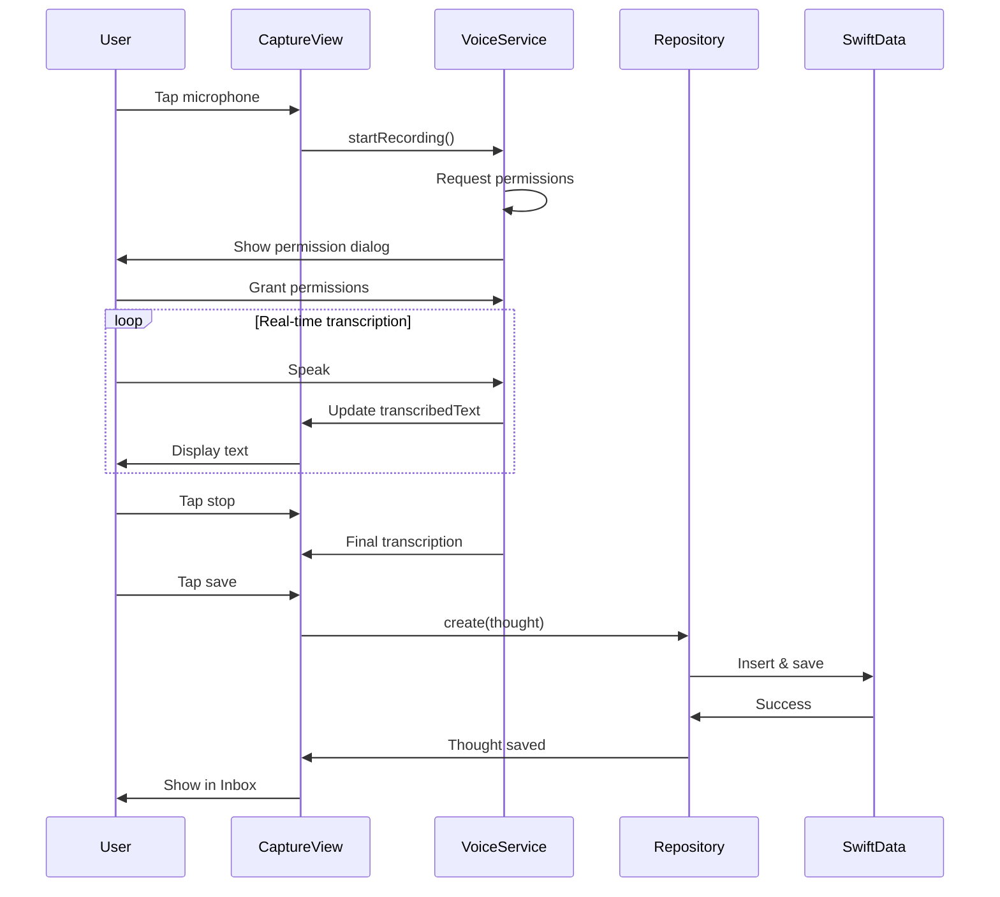

# Offload

An iOS app for adults with ADHD to quickly offload thoughts and organize them later, optionally with AI assistance.

[](https://www.apple.com/ios/)
[](https://swift.org)
[](https://developer.apple.com/xcode/swiftui/)
[](LICENSE)

## Table of Contents

- [About](#about)
- [Current Status](#current-status)
- [Architecture](#architecture)
- [Data Model](#data-model)
- [Project Structure](#project-structure)
- [Getting Started](#getting-started)
- [Features](#features)
- [Documentation](#documentation)
- [Tech Stack](#tech-stack)
- [Contributing](#contributing)
- [License](#license)

## About

Offload is an iOS-first app that turns quick “brain dump” captures (text or voice) into simple, organized **plans** and lists—tasks, shopping, and follow-ups—so you can get mental space back.

Most productivity tools assume you’ll calmly plan everything up front. Offload starts where real life starts: random thoughts, urgency spikes, and “I’ll remember” moments. Capture in seconds, then let the app help you sort and clarify what’s next—without making everything feel time-sensitive or turning your life into a project management system.

The app follows a simple principle:

**Capture First, Organize Later (Optionally with AI)**

### Core Philosophy

- **Psychological Safety**: No guilt, no shame, no forced structure
- **Offline-First**: Works completely offline, on-device processing
- **User Control**: AI suggests, never auto-modifies
- **Privacy**: All data stays on device, no cloud required

## Current Status

🚧 **Active Development** - Pre-release prototype

### ✅ Implemented

- Voice & text capture with on-device transcription
- Brain dump inbox with lifecycle tracking
- Event-sourced architecture for AI workflow
- Core data models and repositories

### 🔄 In Progress

- AI workflow repositories
- Organization UI
- Comprehensive test suite

### 📋 Upcoming

- AI-assisted organization with user approval
- Manual task/plan organization
- Advanced features (recurrence, sharing, widgets)

See [Implementation Plan](docs/IMPLEMENTATION_PLAN.md) for full roadmap.

## Architecture

### System Overview



### iOS App Architecture

Feature-based modular architecture with clear separation of concerns:



## Data Model

### Entity Relationship Diagram



### Data Flow: Thought Capture to Task



## Project Structure

This is a monorepo containing:

```text
offload/
├── ios/                          # iOS application
│   ├── Offload/
│   │   ├── App/                  # Application entry point
│   │   ├── Features/             # Feature modules
│   │   │   ├── Capture/          # Voice & text capture
│   │   │   ├── Inbox/            # Thought inbox
│   │   │   └── Organize/         # Task organization
│   │   ├── Domain/               # Business logic
│   │   │   └── Models/           # SwiftData models
│   │   ├── Data/                 # Data layer
│   │   │   ├── Repositories/     # Data access
│   │   │   ├── Persistence/      # SwiftData setup
│   │   │   └── Services/         # Voice, AI services
│   │   ├── DesignSystem/         # UI components, theme
│   │   └── Resources/            # Assets
│   └── OffloadTests/             # Unit tests
├── backend/                      # Backend services (Phase 3+)
├── docs/                         # Documentation
│   ├── prd/                      # Product requirements
│   ├── decisions/                # Architecture Decision Records
│   └── VOICE_CAPTURE_TESTING.md
└── scripts/                      # Build scripts
```

## Getting Started

### Prerequisites

- **Xcode 15.0+** (for iOS 17 support)
- **iOS 17.0+** target device or simulator
- **macOS 14.0+** for development

### Building & Running

1. **Clone the repository**
   ```bash
   git clone https://github.com/Will-Conklin/offload.git
   cd offload
   ```

2. **Open the Xcode project**
   ```bash
   open ios/Offload.xcodeproj
   ```

3. **Select a target**
   - For simulator: Choose any iOS 17+ simulator
   - For device: Connect iPhone and select it

4. **Build and run** (⌘R)

### Running Tests

1. Add test files to Xcode project (one-time setup):
   - Right-click `OffloadTests` folder → "Add Files to 'Offload'..."
   - Select `TaskRepositoryTests.swift` and `ProjectRepositoryTests.swift`
   - Ensure "OffloadTests" target is checked

2. Run tests (⌘U)

## Features

### ✅ Implemented (Weeks 0-2)

#### Thought Capture

- **Text Input**: Quick capture with minimal friction
- **Voice Recording**: Real-time on-device transcription
  - Uses iOS Speech framework (offline, iOS 17+)
  - Live transcription updates as you speak
  - Editable after transcription
  - Privacy-first (no cloud processing)

#### Data Management

- **SwiftData Persistence**: All data stored locally
- **Relationships**: Tasks ↔ Projects, Tags, Categories
- **Query System**: 15 optimized repository methods
- **Delete Safety**: Nullify rules prevent data loss

### 🚧 In Development

#### Manual Organization (Week 3)

- Task detail editing
- Project management
- Category and tag assignment
- Inbox → Task conversion

### 📅 Planned (Weeks 4+)

#### AI-Assisted Organization (Phase 3)

- Optional AI suggestions for organizing thoughts
- Pattern detection (e.g., "call dentist" → Communication)
- User approval required for all changes
- Can be completely disabled

#### Advanced Features (Phase 4+)

- Overwhelm detection and gentle nudges
- Recurring tasks (if validated by user research)
- Multiple capture sources (clipboard, share extension, widget)
- Backend sync (optional)

## Documentation

### Core Documentation

- 📱 [iOS Development Guide](ios/README.md)
- 📋 [Product Requirements Document](docs/prd/v1.md)
- 🏗️ [Architecture Decision Records](docs/decisions/)
- 📦 [Project Scaffolding Details](ios/SCAFFOLDING.md)

### Testing & Development

- 🎤 [Voice Capture Testing Guide](docs/VOICE_CAPTURE_TESTING.md)
- 🧪 Test Coverage: 45+ unit tests for repositories

### Implementation

- 📅 [30-Day Implementation Plan](~/.claude/plans/reactive-greeting-clover.md)
- ✅ Week 0: Scaffolding (Complete)
- ✅ Week 1: Voice Capture (Complete)
- ✅ Week 2: Data Layer (Complete)
- 🔄 Week 3: Organization UI (In Progress)

## Tech Stack

### iOS Application

- **UI Framework**: SwiftUI 5.0
- **Persistence**: SwiftData (iOS 17+)
- **Speech**: iOS Speech Framework (offline)
- **Audio**: AVFoundation (AVAudioEngine)
- **Architecture**: Feature-based modules, Repository pattern

### Backend (Phase 3+)

- **Language**: Python (FastAPI)
- **AI**: OpenAI/Anthropic API proxy
- **Infrastructure**: TBD

### Development

- **Language**: Swift 5.9
- **Min iOS**: 17.0
- **Testing**: XCTest
- **CI/CD**: GitHub Actions (planned)

See [ADR-0001](docs/decisions/ADR-0001-stack.md) for detailed technical decisions.

## Development Principles

### ADHD-Friendly Design

- **No Forced Structure**: Capture without categorization
- **No Guilt**: No red warnings, no streaks, no shame
- **No Auto-Modification**: AI suggests, user decides
- **Offline-First**: Works without internet

### Privacy & Safety

- **On-Device Processing**: Speech recognition runs locally
- **No Cloud Dependency**: All data stays on device (Phase 1-2)
- **Optional Backend**: Cloud features are opt-in (Phase 3+)
- **No Tracking**: No analytics, no telemetry

### Code Quality

- **Test Coverage**: Comprehensive unit tests (45+ tests)
- **Type Safety**: SwiftData relationships with proper typing
- **Documentation**: Inline docs, ADRs, detailed commit messages
- **Conventional Commits**: Semantic versioning ready

## Contributing

This is currently a personal project. Contributions guidelines to be added.

## License

See [LICENSE](LICENSE) for details.
