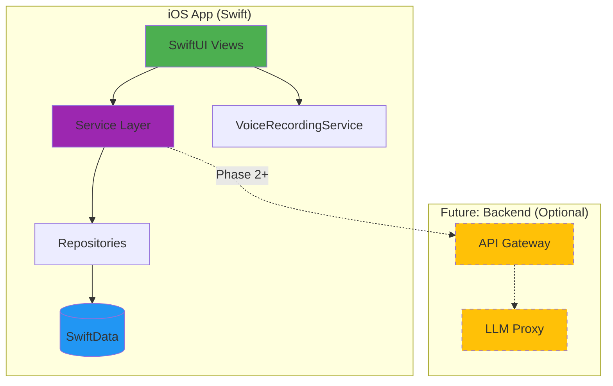
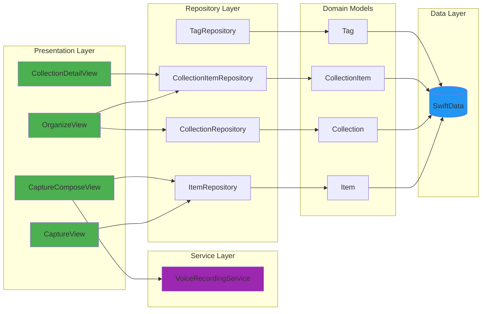
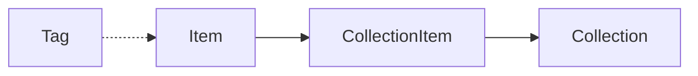
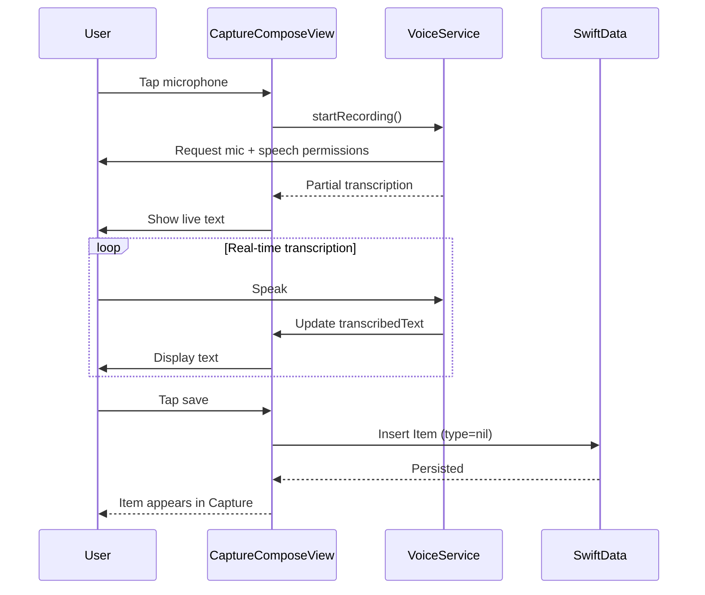

<!--
Intent: Provide an up-to-date overview of Offload, including current
implementation status and remaining work.
-->

# Offload

An iOS app to quickly capture thoughts and organize them later, optionally with
AI assistance.

[![iOS][badge-ios]][link-ios]
[![Swift][badge-swift]][link-swift]
[![SwiftUI][badge-swiftui]][link-swiftui]
[![License][badge-license]][link-license]
[![iOS Build][b-ios-build]][l-ios-build]
[![iOS Tests][b-ios-tests]][l-ios-tests]
[![Coverage][b-ios-coverage]][l-ios-coverage]

[badge-ios]: https://img.shields.io/badge/iOS-17.0+-blue.svg
[link-ios]: https://www.apple.com/ios/
[badge-swift]: https://img.shields.io/badge/Swift-5.9-orange.svg
[link-swift]: https://swift.org
[badge-swiftui]: https://img.shields.io/badge/SwiftUI-5.0-green.svg
[link-swiftui]: https://developer.apple.com/xcode/swiftui/
[badge-license]: https://img.shields.io/badge/license-MIT-lightgrey.svg
[link-license]: LICENSE
[b-ios-build]: https://github.com/Will-Conklin/offload/actions/workflows/ios-build.yml/badge.svg
[l-ios-build]: https://github.com/Will-Conklin/offload/actions/workflows/ios-build.yml
[b-ios-tests]: https://github.com/Will-Conklin/offload/actions/workflows/ios-tests.yml/badge.svg
[l-ios-tests]: https://github.com/Will-Conklin/offload/actions/workflows/ios-tests.yml
[b-ios-coverage]: https://img.shields.io/github/actions/workflow/status/Will-Conklin/offload/ios-tests.yml?branch=main&label=coverage&logo=githubactions
[l-ios-coverage]: https://github.com/Will-Conklin/offload/actions/workflows/ios-tests.yml

## Table of Contents

- [About](#about)
- [Current Status](#current-status)
- [Architecture](#architecture)
- [Data Model](#data-model)
- [Project Structure](#project-structure)
- [Getting Started](#getting-started)
- [Features](#features)
- [Documentation](#documentation)
- [Tech Stack](#tech-stack)
- [Contributing](#contributing)
- [License](#license)

## About

Offload is an iOS-first app that turns quick thought captures (text or voice)
into simple, organized **plans** and lists—tasks, shopping, and follow-ups—
so you can get mental space back.

Most productivity tools assume you'll calmly plan everything up front. Offload
starts where real life starts: random thoughts, urgency spikes, and "I'll
remember" moments. Capture in seconds, then let the app help you sort and
clarify what's next—without making everything feel time-sensitive or turning
your life into a project management system.

The app follows a simple principle: capture first, organize later (optionally
with AI).

### Core Philosophy

- **Psychological Safety**: No guilt, no shame, no forced structure
- **Offline-First**: Works completely offline, on-device processing
- **User Control**: AI suggests, never auto-modifies
- **Privacy**: All data stays on device, no cloud required

## Current Status

✅ **Phase 1-3 Remediation Complete** — All critical bugs fixed, architecture
improvements done.
🚧 **UI/UX Modernization** — Research complete, implementation starting Week 2.
🚧 **AI Workflows** — Deferred to post-v1; manual capture and organization in
progress.

### ✅ Implemented (Core)

- SwiftData core models (Item, Collection, CollectionItem, Tag)
- Repository layer for items, collections, collection items, and tags
- SwiftUI capture + inbox views with text and voice recording via
  `VoiceRecordingService`
- Persistence wired through `PersistenceController` for production and preview
  containers

### 🔄 In Progress

- **Critical Remediation:** Phase 1-3 complete (8/8 critical, 5/5 high priority,
  3/3 architecture). Testing and validation in progress.
- **UI/UX Modernization:** Research complete. Week 2-8 implementation planned
  (glassmorphism, components, ADHD features).
- **AI Workflows:** Organization flows deferred to post-v1.
- **Organization UI:** Organize tab and Settings view exist with TODOs.
  MainTabView with tab-based navigation in place.

### 📋 Upcoming (See [Master Plan](docs/plans/master-plan.md))

- **Weeks 1-2:** Testing & validation of Phase 1-3 fixes
- **Weeks 2-4:** UI foundation (glassmorphism, components, micro-interactions)
- **Weeks 5-6:** ADHD features (visual timeline, accessibility audit)
- **Weeks 7-8:** Integration, polish, v1 release candidate
- **Post-v1:** AI hand-off workflows, backend sync, widgets

## Architecture

### System Overview



### iOS App Architecture

Feature-based modular architecture with clear separation of concerns:



## Data Model

- **Item**: Core content entity (uncategorized capture when `type` is nil)
- **Collection**: Container for items (plan when `isStructured` is true, list when false)
- **CollectionItem**: Join model for many-to-many relationships, with ordering and hierarchy
- **Tag**: Tag metadata; items store tag names in `Item.tags`



### Data Flow: Capture to Capture View



## Project Structure

This is a monorepo containing:

```text
offload/
├── ios/                          # iOS application
│   ├── Offload/
│   │   ├── App/                  # Application entry point
│   │   ├── Features/             # Feature modules
│   │   │   ├── Capture/         # Capture compose + list
│   │   │   └── Organize/         # Plan/list organization
│   │   ├── Domain/               # Business logic
│   │   │   └── Models/           # SwiftData models
│   │   ├── Data/                 # Data layer
│   │   │   ├── Repositories/     # Data access
│   │   │   ├── Persistence/      # SwiftData setup
│   │   │   └── Services/         # Voice, AI services
│   │   ├── DesignSystem/         # UI components, theme
│   │   └── Resources/            # Assets
│   └── OffloadTests/             # Unit tests
├── backend/                      # Backend services (Phase 3+)
├── docs/                         # Documentation
│   ├── prd/                      # Product requirements
│   ├── decisions/                # Architecture Decision Records
│   ├── plans/                    # Implementation plans
│   └── testing/                  # Test guides and results
└── scripts/                      # Build scripts
```

## Getting Started

### Prerequisites

- **Xcode 15.0+** (for iOS 17 support)
- **iOS 17.0+** target device or simulator
- **macOS 14.0+** for development

### Building & Running

1. **Clone the repository**

   ```bash
   git clone https://github.com/Will-Conklin/offload.git
   cd offload
   ```

2. **Open the Xcode project**

   ```bash
   open ios/Offload.xcodeproj
   ```

3. **Select a target**
   - For simulator: Choose any iOS 17+ simulator
   - For device: Connect iPhone and select it

4. **Build and run** (⌘R)

### Running Tests

Run tests with ⌘U in Xcode. Unit tests use in-memory SwiftData containers so
they are isolated and fast; ensure test files are included in the
`OffloadTests` target after adding new ones.

## Features

### ✅ Implemented Features

- **Capture**: Text and voice capture with live transcription using the Speech
  framework (offline-first)
- **Capture View**: Inbox list of uncategorized items (type=nil) with completion
  and deletion
- **Data Layer**: SwiftData models for items, collections, collection items, and tags
- **Repositories**: CRUD helpers for core models; preview container seeded for
  SwiftUI previews

### 🚧 In Development

- Manual organization surfaces for plans and lists (Organize tab + detail views)
- Tag management and cleanup flows
- Settings, deeper navigation, and consistent tab-based shell

### 📅 Planned

- AI-assisted organization with explicit user approval
- Optional backend sync and collaboration features
- Widgets, share extension, and recurrence (based on validation)

## Documentation

### Core Documentation

- 📱 [iOS Development Guide](ios/README.md)
- 📋 [Product Requirements Document](docs/prd/v1.md)
- 📍 **[Master Implementation Plan](docs/plans/master-plan.md)** ⭐ Single
  source of truth for all planning
- 🏗️ [Architecture Decision Records](docs/decisions/)
- 🧭 [ADHD UX/UI Guardrails (ADR-0003)](docs/decisions/ADR-0003-adhd-ux-guardrails.md)
- 🧠 [Capture Model Plan](docs/plans/brain-dump-model.md)
- 🎨 [iOS UI Trends Research (2025-2026)](docs/research/ios-ui-trends-2025.md)
- 🎨 [ADHD-First UX/UI Research](docs/research/adhd-ux-ui.md)
- 📦 [Project Scaffolding Details](ios/SCAFFOLDING.md)

### Testing & Development

- 🎤 [Voice Capture Testing Guide](docs/testing/voice-capture.md)
- 📊 [Voice Capture Test Results](docs/testing/voice-capture-results.md)
- 🧪 SwiftData repositories and model tests in `ios/OffloadTests`

### Implementation Status

- ✅ **Phase 1-3 Remediation:** All critical bugs fixed, architecture
  improvements complete
- ✅ **Data Layer:** Item/Collection/CollectionItem/Tag models and repositories
- ✅ **Capture UI:** Capture compose and Capture view with voice/text
- 🚧 **UI/UX Modernization:** Research complete, Weeks 2-8 implementation planned
- 🚧 **Organization UI:** Organize tab flows and collection detail surfaces
- 📅 **Post-v1:** AI workflows, backend sync, widgets

See [Master Plan](docs/plans/master-plan.md) for detailed roadmap.

## Tech Stack

### iOS Application

- **UI Framework**: SwiftUI 5.0
- **Persistence**: SwiftData (iOS 17+)
- **Speech**: iOS Speech Framework (offline)
- **Audio**: AVFoundation (AVAudioEngine)
- **Architecture**: Feature-based modules, Repository pattern

### Backend (Phase 3+)

- **Language**: TBD (planned)
- **API**: TBD
- **AI**: OpenAI/Anthropic API proxy
- **Infrastructure**: TBD

### Development

- **Language**: Swift 5.9
- **Min iOS**: 17.0
- **Testing**: XCTest with SwiftData in-memory containers
- **CI/CD**: GitHub Actions

See [ADR-0001](docs/decisions/ADR-0001-stack.md) for detailed technical
decisions.

## Development Principles

### Friction-Free Design

- **No Forced Structure**: Capture without categorization
- **No Guilt**: No red warnings, no streaks, no shame
- **No Auto-Modification**: AI suggests, user decides
- **Offline-First**: Works without internet

### Privacy & Safety

- **On-Device Processing**: Speech recognition runs locally
- **No Cloud Dependency**: All data stays on device (Phase 1-2)
- **Optional Backend**: Cloud features are opt-in (Phase 3+)
- **No Tracking**: No analytics, no telemetry

### Code Quality

- **Test Coverage**: Comprehensive unit tests (45+ tests)
- **Type Safety**: SwiftData relationships with proper typing
- **Documentation**: Inline docs, ADRs, detailed commit messages
- **Conventional Commits**: Semantic versioning ready

## Contributing

See [CONTRIBUTING.md](CONTRIBUTING.md) for contribution guidelines.

## License

See [LICENSE](LICENSE) for details.
